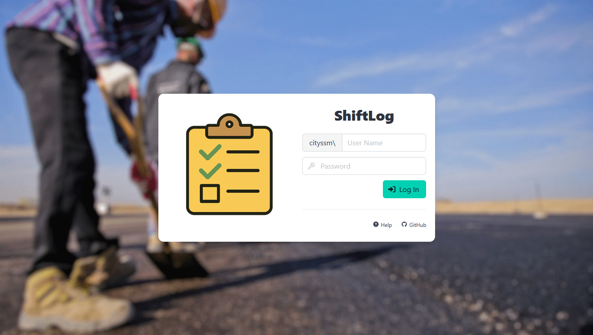
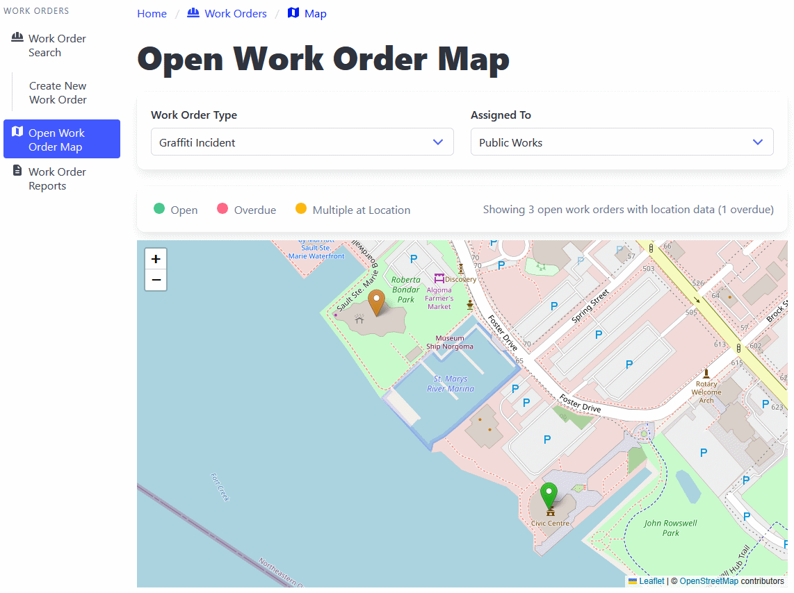

# ShiftLog

🚧 **Under Development** 🚧

A lightweight and flexible work management system with:

- ✔️ Work order recording
- ✏️ Shift activity logging
- ✏️ Timesheet tracking.

Built with the following use cases in mind:

- Graffiti cleanup work order tracking
- Accessibility complaint management
- Freedom of information request tracking
- Public works work order management

## Features

### Free Mapping!

Thanks to the community at [OpenStreetMap](https://www.openstreetmap.org/about),
mapping does not need to come with a huge cost.

### Integration Friendly

Currently has data sync integrations with
[Avanti](https://www.avanti.ca/),
[CentralSquare](https://www.centralsquare.com/)'s Pearl,
and [ArcGIS](https://www.esri.com/en-us/arcgis/products/arcgis-online/overview).

## About this Project

- 📘 [Documentation](./docs/README.md) (Coming Soon)
- 🤗 [Code of Conduct](CODE_OF_CONDUCT.md)
- 🥰 [Contributing Guidelines](CONTRIBUTING.md)
- 🛡️ [Security Policy](SECURITY.md)
- 📃 [MIT Licence](LICENSE.md)

This system is a rewrite of an internal system used by the City's Public Works
department to track activity occurring during shifts that does not necessarily
fit well into a work order itself. The scope has then been expanded to cover
several other outstanding "work order"-like projects.

Although the system is quite niche, it's being released in an open source
environment in hopes to pool developer resources from other municipalities
looking to move away from older, legacy systems or complicated spreadsheets.

It is being shared to start the dialog among other municipalities and present
an option to those who may be outgrowing managing tasks in spreadsheets
and looking for a more robust alternative.
