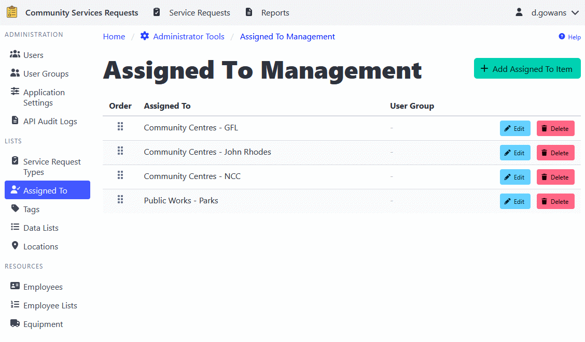

[Home](https://cityssm.github.io/shiftlog/)
•
[Help](https://cityssm.github.io/shiftlog/docs/)
•
[Administrator Tools](https://cityssm.github.io/shiftlog/docs/admin.html)

# Assigned To Management

The Assigned To Management section maintains a list of assignees that can be
associated with work orders and other records. This feature helps standardize
who work is assigned to, making it easier to track assignments and filter
records by assignee.

## Adding an Assigned To Item

1. Navigate to **Administrator Tools** > **Assigned To**.
2. Click the **Add Assigned To Item** button.
3. Enter the assignee name (e.g., person name, department, team, or role).
4. Optionally, select a **User Group** to restrict visibility to specific users.
5. Click **Add** to create the item.

## Editing an Assigned To Item

1. Navigate to **Administrator Tools** > **Assigned To**.
2. Find the item you want to edit.
3. Click the **Edit** button.
4. Update the assignee name or user group restriction as needed.
5. Click **Update** to apply changes.

## Reordering Assigned To Items

The order of assigned to items determines how they appear in dropdown lists
throughout the application.

1. Navigate to **Administrator Tools** > **Assigned To**.
2. Use the drag-and-drop handle (grip icon) to reorder items.
3. Changes are saved automatically.

## Deleting an Assigned To Item

1. Navigate to **Administrator Tools** > **Assigned To**.
2. Find the item you want to delete.
3. Click the **Delete** button.
4. Confirm the deletion.

⚠️ **Note**: Deleting an assigned to item will not remove it from existing
records. It will only make it unavailable for future assignments.

## User Group Restrictions

You can restrict the visibility of assigned to items to specific user groups.
When a user group is assigned to an item:

- Only users in that group will see the item in their dropdown lists
- All administrators can see all items regardless of user group
- Existing records with that assignment remain visible to all users

This feature is useful for:

- Departmental or team-specific assignees
- Role-based assignment options
- Limiting options to relevant choices for different user groups

---

## Related Links

- [Administrator Tools](./admin.md) - Main admin documentation
- [User Management](./adminUsers.md)
- [User Group Management](./adminUserGroups.md)
- [Application Settings](./adminSettings.md)
- [Work Order Types](./adminWorkOrderTypes.md)
- [Tag Management](./adminTags.md)
- [Data Lists](./adminDataLists.md)
- [Employee Management](./adminEmployees.md)
- [Equipment Management](./adminEquipment.md)
- [Location Management](./adminLocations.md)
