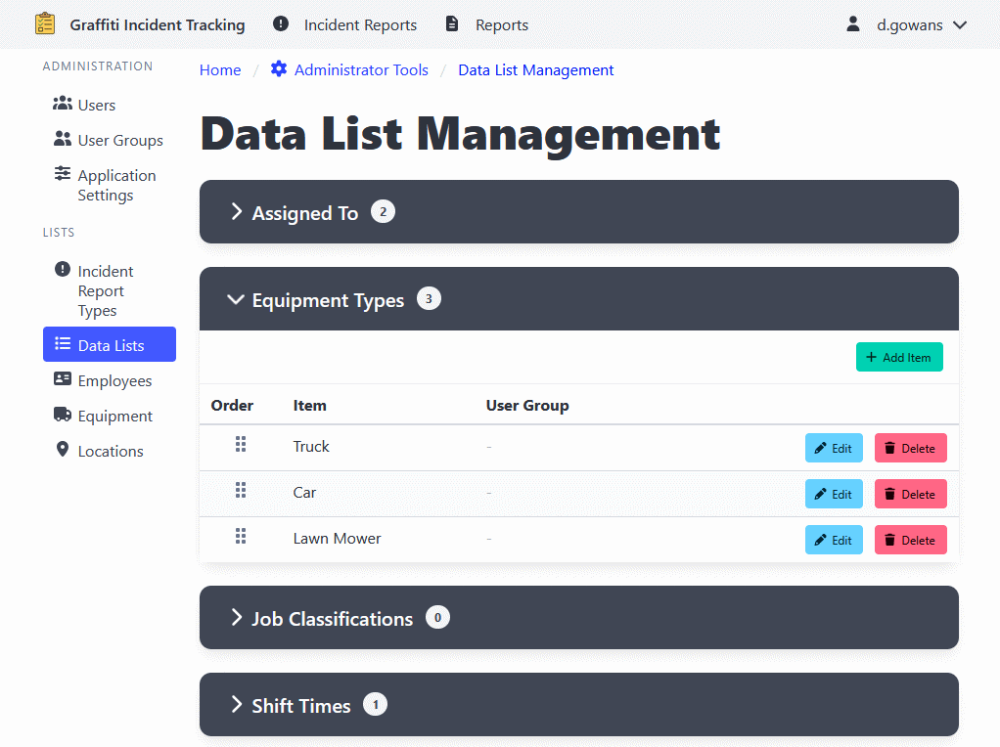

[Home](https://cityssm.github.io/shiftlog/)
•
[Help](https://cityssm.github.io/shiftlog/docs/)
•
[Administrator Tools](https://cityssm.github.io/shiftlog/docs/admin.html)

# Data Lists

Data Lists are customizable dropdown lists used throughout the application
to maintain consistency in data entry.

## Managing Data Lists

1. Navigate to **Administrator Tools** > **Data Lists**.
2. Select the data list you want to manage from the available lists.

## Adding a Data List Item

1. Select a data list.
2. Click the **Add Item** button.
3. Enter the item details.
4. Click **Add Item** to add the item.

## Editing Data List Items

⚠️ When editing data list items, never change the meaning of the item.

1. Select a data list.
2. Click on the item you want to edit.
3. Update the information.
4. Click **Update Item** to apply changes.

## Reordering Data List Items

1. Select a data list.
2. Use the drag-and-drop interface to reorder items.
3. The order determines how items appear in dropdown lists.

---

## Related Links

- [Administrator Tools](./admin.md) - Main admin documentation
- [User Management](./adminUsers.md)
- [User Group Management](./adminUserGroups.md)
- [Application Settings](./adminSettings.md)
- [Work Order Types](./adminWorkOrderTypes.md)
- [Employee Management](./adminEmployees.md)
- [Equipment Management](./adminEquipment.md)
- [Location Management](./adminLocations.md)
