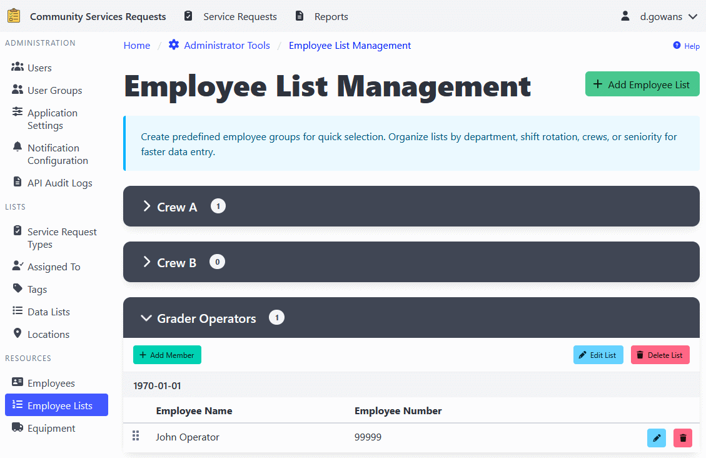

[Home](https://cityssm.github.io/shiftlog/)
•
[Help](https://cityssm.github.io/shiftlog/docs/)
•
[Administrator Tools](https://cityssm.github.io/shiftlog/docs/admin.html)

# Employee List Management

The Employee List Management section allows administrators to create and
maintain predefined lists of employees. These lists can be quickly selected
when recording shift activities or timesheets, making data entry faster and
more consistent.

## Overview

Employee lists are useful for:

- **Recurring shifts** - Save frequently-used employee groups
- **Department teams** - Maintain lists for each department
- **Rotation schedules** - Manage different shift rotations
- **Project teams** - Track employees working on specific projects

## Adding an Employee List

1. Navigate to **Administrator Tools** > **Employee Lists**.
2. Click the **Add Employee List** button.
3. Enter a descriptive name for the list (e.g., "Night Shift Crew", "Roads Department", "Weekend Team").
4. Select employees to include in the list.
5. Optionally, select a **User Group** to restrict visibility to specific users.
6. Click **Save** to create the list.

## Editing an Employee List

1. Navigate to **Administrator Tools** > **Employee Lists**.
2. Find the list you want to edit.
3. Click the **Edit** button.
4. Update the list name, employees, or user group restriction as needed.
5. Click **Save** to apply changes.

## Managing Employees in a List

### Adding Employees

1. Open the employee list for editing.
2. Select additional employees from the available employees list.
3. Use the drag-and-drop interface to reorder employees if needed.
4. Click **Save** to apply changes.

### Removing Employees

1. Open the employee list for editing.
2. Click the **Remove** button next to the employee you want to remove.
3. Click **Save** to apply changes.

### Reordering Employees

The order of employees in a list can be customized:

1. Open the employee list for editing.
2. Use the drag-and-drop handle (grip icon) to reorder employees.
3. Click **Save** to apply the new order.

## Deleting an Employee List

1. Navigate to **Administrator Tools** > **Employee Lists**.
2. Find the list you want to delete.
3. Click the **Delete** button.
4. Confirm the deletion.

⚠️ **Note**: Deleting an employee list will not affect existing shift or
timesheet records. It only removes the list template for future use.

## User Group Restrictions

You can restrict the visibility of employee lists to specific user groups.
When a user group is assigned to a list:

- Only users in that group will see the list when recording shifts or timesheets
- All administrators can see all lists regardless of user group
- This helps keep lists organized and relevant to each user's role

## Using Employee Lists

Once created, employee lists appear:

- In the shift recording interface as quick-select options
- In the timesheet entry interface for batch entry
- As shortcuts for adding multiple employees at once

---

## Related Links

- [Administrator Tools](./admin.md) - Main admin documentation
- [API Audit Logs](./adminApiAuditLogs.md)
- [Application Settings](./adminSettings.md)
- [Assigned To Management](./adminAssignedTo.md)
- [Data Lists](./adminDataLists.md)
- [Employee List Management](./adminEmployeeLists.md)
- [Employee Management](./adminEmployees.md)
- [Equipment Management](./adminEquipment.md)
- [Location Management](./adminLocations.md)
- [Notification Configuration](./adminNotificationConfigurations.md)
- [Tag Management](./adminTags.md)
- [User Group Management](./adminUserGroups.md)
- [User Management](./adminUsers.md)
- [Work Order Types](./adminWorkOrderTypes.md)
