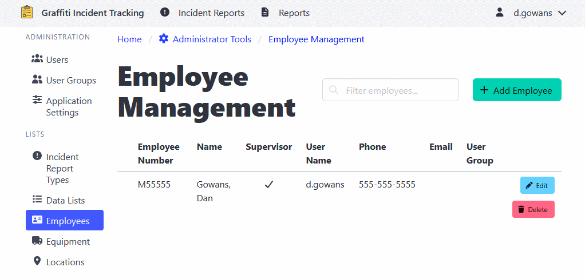

[Home](https://cityssm.github.io/shiftlog/)
•
[Help](https://cityssm.github.io/shiftlog/docs/)
•
[Administrator Tools](https://cityssm.github.io/shiftlog/docs/admin.html)

# Employee Management

The Employee Management section maintains a list of employees that can
be associated with work orders, shifts, and timesheets.

## Adding an Employee

1. Navigate to **Administrator Tools** > **Employees**.
2. Click the **Add Employee** button.
3. Enter employee information:
   - Employee name
   - Employee number or ID
4. Click **Save** to add the employee.

## Editing Employee Information

**Note:** Edits to synced employees may be overwritten by the syncing process.

1. Navigate to **Administrator Tools** > **Employees**.
2. Click on the employee you want to edit.
3. Update the information as needed.
4. Click **Save** to apply changes.

## Deleting an Employee

**Note**: Deleting an employee will not modify past records for the employee.
It will only make them unavailable for future records.

1. Navigate to **Administrator Tools** > **Employees**.
2. Find the employee you want to delete.
3. Click the **Delete** button.
4. Confirm the deletion.

---

## Related Links

- [Administrator Tools](./admin.md) - Main admin documentation
- [User Management](./adminUsers.md)
- [User Group Management](./adminUserGroups.md)
- [Application Settings](./adminSettings.md)
- [Work Order Types](./adminWorkOrderTypes.md)
- [Tag Management](./adminTags.md)
- [Data Lists](./adminDataLists.md)
- [Equipment Management](./adminEquipment.md)
- [Location Management](./adminLocations.md)
