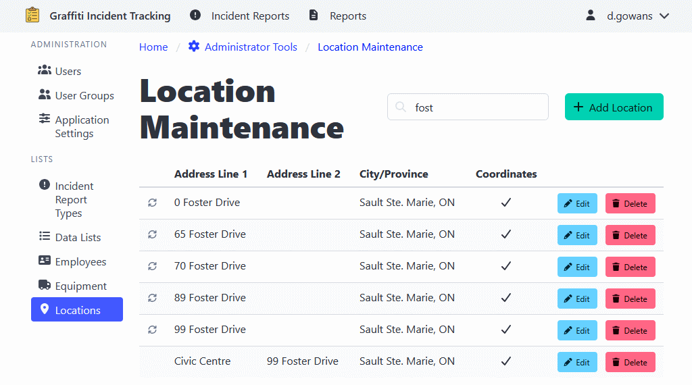

[Home](https://cityssm.github.io/shiftlog/)
•
[Help](https://cityssm.github.io/shiftlog/docs/)
•
[Administrator Tools](https://cityssm.github.io/shiftlog/docs/admin.html)

# Location Management

The Location Management section maintains predefined locations that can be
quickly selected when creating work orders.

## Adding a Location

1. Navigate to **Administrator Tools** > **Locations**.
2. Click the **Add Location** button.
3. Enter location information:
   - Location name
   - Address
   - Coordinates (optional)
4. Click **Add Location** to add the location.

## Editing Locations

1. Navigate to **Administrator Tools** > **Locations**.
2. Click on the location you want to edit.
3. Update the information as needed.
4. Click **Update Location** to apply changes.

## Deleting Locations

1. Navigate to **Administrator Tools** > **Locations**.
2. Find the location you want to delete.
3. Click the **Delete** button.
4. Confirm the deletion.

---

## Related Links

- [Administrator Tools](./admin.md) - Main admin documentation
- [API Audit Logs](./adminApiAuditLogs.md)
- [Application Settings](./adminSettings.md)
- [Assigned To Management](./adminAssignedTo.md)
- [Data Lists](./adminDataLists.md)
- [Employee List Management](./adminEmployeeLists.md)
- [Employee Management](./adminEmployees.md)
- [Equipment Management](./adminEquipment.md)
- [Location Management](./adminLocations.md)
- [Notification Configuration](./adminNotificationConfigurations.md)
- [Tag Management](./adminTags.md)
- [User Group Management](./adminUserGroups.md)
- [User Management](./adminUsers.md)
- [Work Order Types](./adminWorkOrderTypes.md)
