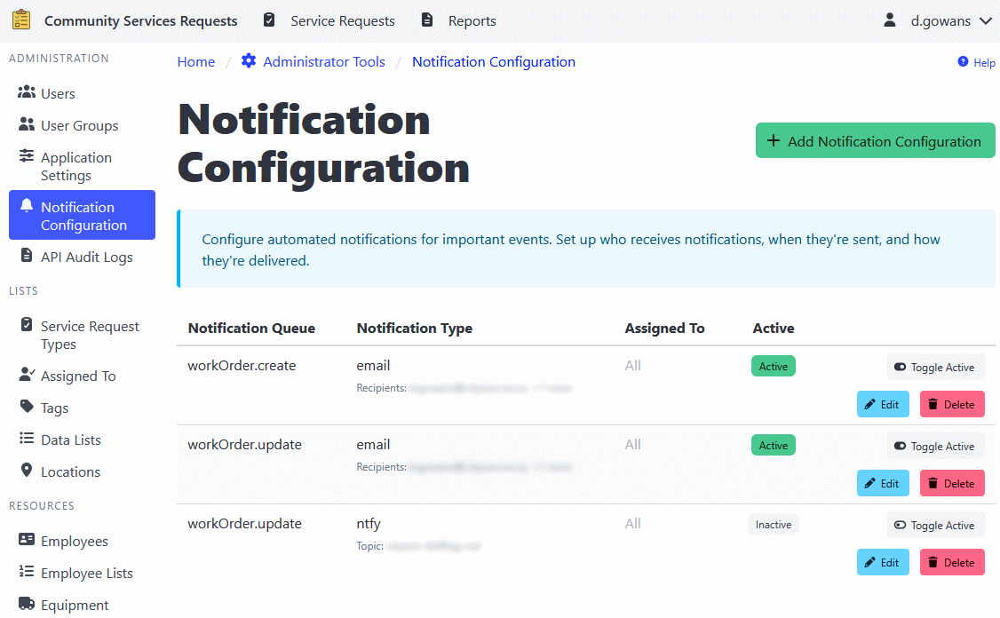

[Home](https://cityssm.github.io/shiftlog/)
•
[Help](https://cityssm.github.io/shiftlog/docs/)
•
[Administrator Tools](https://cityssm.github.io/shiftlog/docs/admin.html)

# Notification Configuration

The Notification Configuration section allows administrators to set up
automated notifications for various events in ShiftLog. This feature ensures
that the right people are notified about important activities, assignments,
and updates in real-time.

## Overview

Notification configurations determine:

- **What** triggers a notification (notification queue type)
- **How** the notification is sent (notification type/protocol)
- **Who** receives the notification (assigned to item)
- **When** notifications are active (active/inactive status)

## Notification Queue Types

Different events in ShiftLog can trigger notifications:

- **Work Order Created** - When a new work order is created
- **Work Order Update** - When a work order is changed

## Notification Types (Protocols)

ShiftLog supports multiple notification delivery methods:

- **Email** - Send notifications via email.
- **Ntfy** - Send phone and browser notifications through the ntfy notification service.
- **MS Teams** - POST notification data to a webhook URL.

⚠️ **Note**: Notification protocols must be configured in the application
settings before they can be used in notification configurations.

## Adding a Notification Configuration

1. Navigate to **Administrator Tools** > **Notification Configuration**.
2. Click the **Add Notification Configuration** button.
3. Select a **Notification Queue** (the event that triggers the notification).
4. Select a **Notification Type** (how the notification will be sent).
5. Select an **Assigned To** item (who should receive the notification).
6. Set the **Active** status (whether the notification is enabled).
7. Click **Add** to create the configuration.

## Editing a Notification Configuration

1. Navigate to **Administrator Tools** > **Notification Configuration**.
2. Find the configuration you want to edit.
3. Click the **Edit** button.
4. Update the notification settings as needed.
5. Click **Save** to apply changes.

## Activating/Deactivating Notifications

Notification configurations can be temporarily disabled without deleting them:

1. Navigate to **Administrator Tools** > **Notification Configuration**.
2. Find the configuration you want to enable or disable.
3. Toggle the **Active** checkbox.
4. Click **Save** to apply the change.

**Active configurations** will send notifications when triggered.
**Inactive configurations** will not send notifications, but remain in the system.

## Deleting a Notification Configuration

1. Navigate to **Administrator Tools** > **Notification Configuration**.
2. Find the configuration you want to delete.
3. Click the **Delete** button.
4. Confirm the deletion.

## Understanding Assigned To Items

The **Assigned To** field determines who receives the notification:

- Must match an item from the **Assigned To Management** section
- Can represent individuals, departments, teams, or roles
- The actual delivery addresses (email, phone) are configured separately
  in the notification protocol settings

## Testing Notifications

To verify that notifications are working correctly:

1. Create a test notification configuration
2. Trigger the event (e.g., create a test work order)
3. Verify that the notification is received
4. Review logs if notifications are not being delivered

## Troubleshooting

### Notifications Not Sending

1. **Check configuration is active** - Ensure the Active checkbox is checked
2. **Verify protocol setup** - Confirm notification protocols are configured in settings
3. **Check assigned to mapping** - Verify the assigned to item has delivery addresses
4. **Review system logs** - Check application logs for error messages

### Duplicate Notifications

- Multiple configurations for the same queue type will send multiple notifications
- Review and consolidate configurations if receiving duplicates

---

## Best Practices

1. **Start with test configurations** - Test notifications before deploying widely
2. **Use descriptive names** - Choose clear assigned to names for easy identification
3. **Limit notifications** - Only notify for critical events to avoid alert fatigue
4. **Monitor delivery** - Regularly check that notifications are being delivered
5. **Document recipients** - Keep records of who receives what notifications
6. **Review periodically** - Audit notification configurations regularly

---

## Related Links

- [Administrator Tools](./admin.md) - Main admin documentation
- [API Audit Logs](./adminApiAuditLogs.md)
- [Application Settings](./adminSettings.md)
- [Assigned To Management](./adminAssignedTo.md)
- [Data Lists](./adminDataLists.md)
- [Employee List Management](./adminEmployeeLists.md)
- [Employee Management](./adminEmployees.md)
- [Equipment Management](./adminEquipment.md)
- [Location Management](./adminLocations.md)
- [Notification Configuration](./adminNotificationConfigurations.md)
- [Tag Management](./adminTags.md)
- [User Group Management](./adminUserGroups.md)
- [User Management](./adminUsers.md)
- [Work Order Types](./adminWorkOrderTypes.md)
