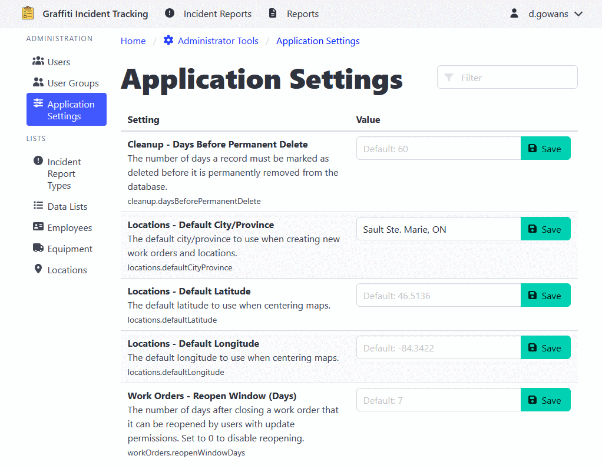

[Home](https://cityssm.github.io/shiftlog/)
•
[Help](https://cityssm.github.io/shiftlog/docs/)
•
[Administrator Tools](https://cityssm.github.io/shiftlog/docs/admin.html)

# Application Settings

The Application Settings section allows administrators to configure various
system-wide options.

## Accessing Settings

1. Navigate to **Administrator Tools** > **Application Settings**.
2. Browse or search for the setting you want to modify.
3. Click on the setting to edit its value.
4. Save the changes.

---

## Related Links

- [Administrator Tools](./admin.md) - Main admin documentation
- [User Management](./adminUsers.md)
- [User Group Management](./adminUserGroups.md)
- [Work Order Types](./adminWorkOrderTypes.md)
- [Tag Management](./adminTags.md)
- [Data Lists](./adminDataLists.md)
- [Employee Management](./adminEmployees.md)
- [Equipment Management](./adminEquipment.md)
- [Location Management](./adminLocations.md)
