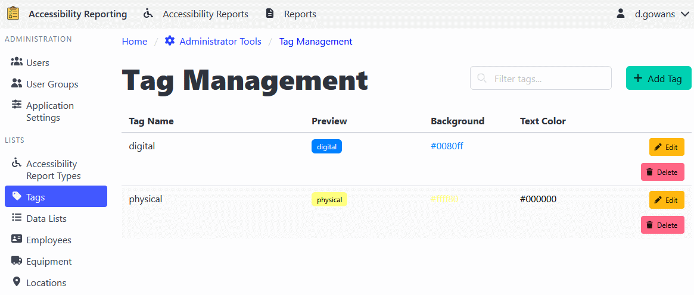

[Home](https://cityssm.github.io/shiftlog/)
•
[Help](https://cityssm.github.io/shiftlog/docs/)
•
[Administrator Tools](https://cityssm.github.io/shiftlog/docs/admin.html)

# Tag Management

The Tag Management section allows administrators to create and manage tags
that can be applied to work orders. Tags provide a flexible way to categorize,
prioritize, and organize work orders with customizable color-coding.

## Adding a Tag

1. Navigate to **Administrator Tools** > **Tags**.
2. Click the **Add Tag** button.
3. Enter tag information:
   - **Tag Name**: A descriptive name for the tag (e.g., "Priority", "In Progress", "Urgent")
   - **Background Color**: Choose a background color for the tag
   - **Text Color**: Choose a text color for optimal readability
4. Click **Add Tag** to create the tag.

## Editing Tags

1. Navigate to **Administrator Tools** > **Tags**.
2. Find the tag you want to edit.
3. Click the **Edit** button.
4. Update the colors as needed (tag name cannot be changed after creation).
5. Click **Save Changes** to apply the updates.

## Deleting Tags

1. Navigate to **Administrator Tools** > **Tags**.
2. Find the tag you want to delete.
3. Click the **Delete** button.
4. Confirm the deletion.

⚠️ **Note**: Deleting a tag will not remove it from existing work orders that
use it, but those tags will display with default styling instead of the
configured colors.

## Using Tags on Work Orders

Tags created in the Tag Management interface can be applied to work orders:

1. Open a work order in edit mode.
2. Navigate to the **Tags** tab.
3. Click **Add Tag** to add a new tag.
4. Enter the tag name.
5. If the tag exists in the Tag Management system, it will display with the
   configured colors. Otherwise, it will display with default styling.

### Tag Display

- **System Tags**: Tags that exist in the Tag Management interface display
  with their configured background and text colors.
- **Ad-hoc Tags**: Tags that don't exist in the system display with default
  Bulma styling.

---

## Best Practices

### Tag Naming

- Use clear, descriptive names that convey meaning at a glance.
- Maintain consistent naming conventions across tags.
- Avoid overly long tag names for better visual presentation.

### Color Selection

- Choose colors that provide good contrast for readability.
- Use consistent color schemes (e.g., red for urgent, yellow for in-progress).
- Ensure text color is readable against the background color.
- Consider color-blind accessibility when selecting colors.

### Tag Management

- Create a core set of commonly used tags for your organization.
- Avoid creating too many tags, which can reduce their effectiveness.
- Periodically review and remove unused tags.
- Document the meaning and usage of each tag for your team.

---

## Related Links

- [Administrator Tools](./admin.md) - Main admin documentation
- [Work Orders](./workOrders.md) - Work order documentation
- [User Management](./adminUsers.md)
- [User Group Management](./adminUserGroups.md)
- [Application Settings](./adminSettings.md)
- [Work Order Types](./adminWorkOrderTypes.md)
- [Data Lists](./adminDataLists.md)
- [Employee Management](./adminEmployees.md)
- [Equipment Management](./adminEquipment.md)
- [Location Management](./adminLocations.md)
