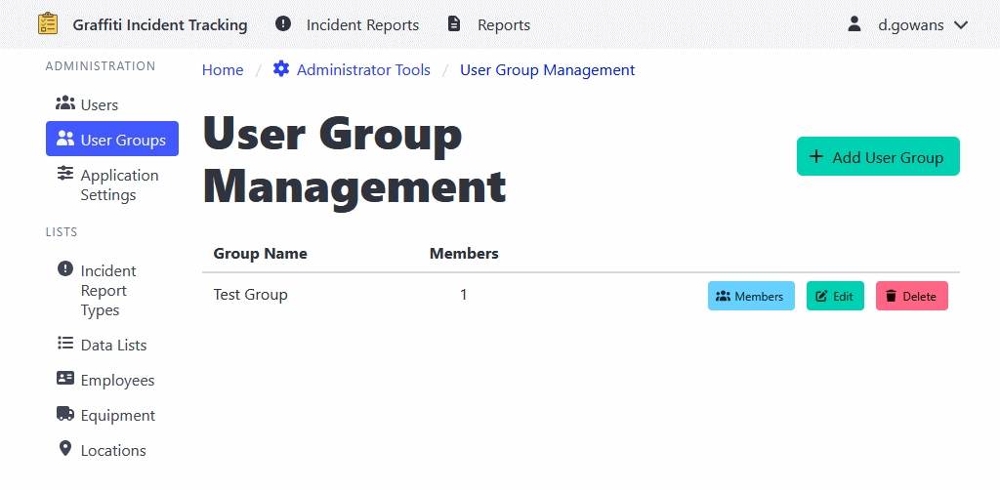

[Home](https://cityssm.github.io/shiftlog/)
•
[Help](https://cityssm.github.io/shiftlog/docs/)
•
[Administrator Tools](https://cityssm.github.io/shiftlog/docs/admin.html)

# User Group Management

User Groups allow you to organize users into logical groups for easier management and reporting.

## Creating a User Group

1. Navigate to **Administrator Tools** > **User Groups**
2. Click the **Add User Group** button
3. Enter the group name and description
4. Click **Save** to create the group

## Adding Members to a User Group

1. Navigate to **Administrator Tools** > **User Groups**
2. Click on the user group
3. Click **Add Member**
4. Select the user from the list
5. Click **Add** to include them in the group

## Managing User Groups

User groups can be used to:
- Organize users by department or role
- Filter and report on activities by group
- Manage permissions collectively

---

## Related Links

- [Administrator Tools](./admin.md) - Main admin documentation
- [User Management](./adminUsers.md)
- [Application Settings](./adminSettings.md)
- [Work Order Types](./adminWorkOrderTypes.md)
- [Data Lists](./adminDataLists.md)
- [Employee Management](./adminEmployees.md)
- [Equipment Management](./adminEquipment.md)
- [Location Management](./adminLocations.md)
