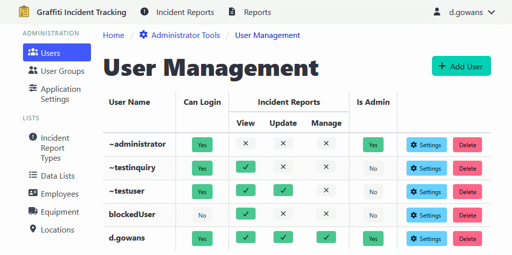

[Home](https://cityssm.github.io/shiftlog/)
•
[Help](https://cityssm.github.io/shiftlog/docs/)
•
[Administrator Tools](https://cityssm.github.io/shiftlog/docs/admin.html)

# User Management

The User Management section allows administrators to create, edit, and
manage user accounts for the ShiftLog application.

**Note:** ShiftLog is flexible in the way it can authenticate users,
but the application does not manage passwords.

## Adding a User

1. Navigate to **Administrator Tools** > **Users**.
2. Click the **Add User** button.
3. Enter the user name.
4. Click **Add User** to create the user.

The user will start with no permissions.

## Editing a User

1. Navigate to **Administrator Tools** > **Users**.
2. Find the user you want to edit.
3. Main section access permissions can be updated by toggling the
   view/update/manage buttons.
4. Additional settings can be found by clicking the **Settings** button.

## User Permissions

Users can have different levels of access for each section:

- **Inquiry Only**: View-only access to records
- **Update**: Can create and edit records
- **Manage**: Full access including administrative functions (e.g., record recovery)

## Deleting a User

1. Navigate to **Administrator Tools** > **Users**.
2. Find the user you want to delete.
3. Click the **Delete** button.
4. Confirm the deletion.

---

## Related Links

- [Administrator Tools](./admin.md) - Main admin documentation
- [User Group Management](./adminUserGroups.md)
- [Application Settings](./adminSettings.md)
- [Work Order Types](./adminWorkOrderTypes.md)
- [Tag Management](./adminTags.md)
- [Data Lists](./adminDataLists.md)
- [Employee Management](./adminEmployees.md)
- [Equipment Management](./adminEquipment.md)
- [Location Management](./adminLocations.md)
