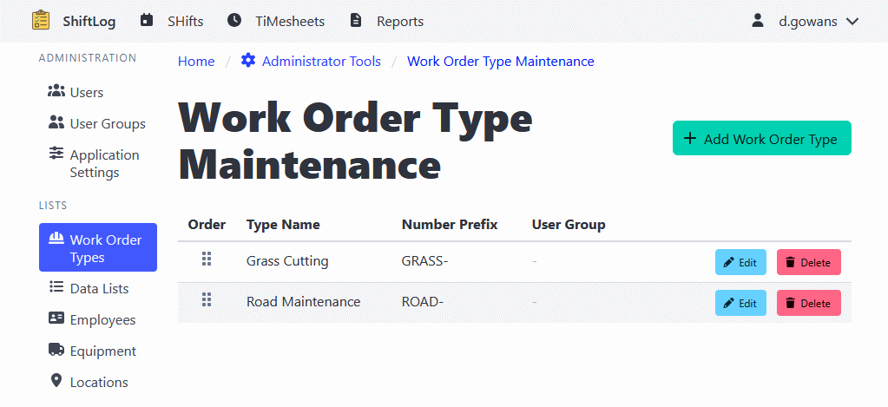

[Home](https://cityssm.github.io/shiftlog/)
•
[Help](https://cityssm.github.io/shiftlog/docs/)
•
[Administrator Tools](https://cityssm.github.io/shiftlog/docs/admin.html)

# Work Order Types

Work Order Types define the categories of work orders that can be created in the system.

## Creating a Work Order Type

1. Navigate to **Administrator Tools** > **Work Order Types**
2. Click the **Add Work Order Type** button
3. Enter the type information:
   - Type name
   - Description
   - Icon class (optional)
   - Additional fields specific to this type
4. Click **Save** to create the type

## Reordering Work Order Types

1. Navigate to **Administrator Tools** > **Work Order Types**
2. Use the drag-and-drop interface to reorder types
3. The order determines how types appear in dropdown lists

## Editing Work Order Types

1. Navigate to **Administrator Tools** > **Work Order Types**
2. Click on the type you want to edit
3. Update the information as needed
4. Click **Save** to apply changes

## Deleting Work Order Types

1. Navigate to **Administrator Tools** > **Work Order Types**
2. Click on the type you want to delete
3. Click the **Delete** button
4. Confirm the deletion

**Note**: You cannot delete a work order type that is currently in use by existing work orders.

---

## Related Links

- [Administrator Tools](./admin.md) - Main admin documentation
- [User Management](./adminUsers.md)
- [User Group Management](./adminUserGroups.md)
- [Application Settings](./adminSettings.md)
- [Data Lists](./adminDataLists.md)
- [Employee Management](./adminEmployees.md)
- [Equipment Management](./adminEquipment.md)
- [Location Management](./adminLocations.md)
